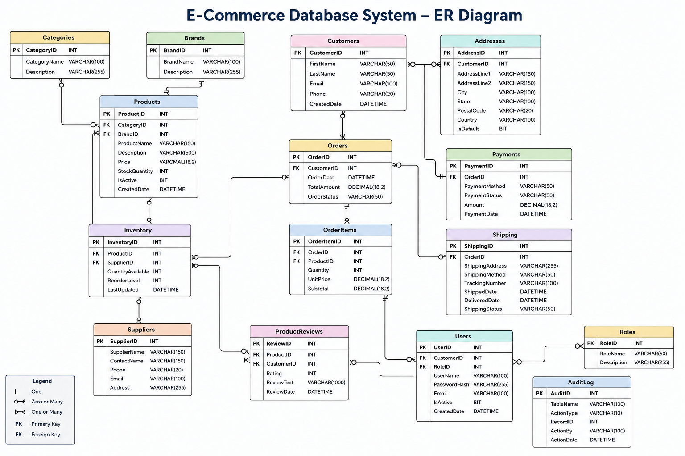

# 🛒 E-Commerce Database System (SQL Server)

A complete SQL Server E-Commerce Database System demonstrating relational database design, T-SQL programming, stored procedures, views, functions, triggers, indexing, reporting, and query optimization.

---

## 📌 Project Overview

This project simulates a real-world E-Commerce platform using Microsoft SQL Server. It includes customers, products, inventory, orders, payments, shipping, reviews, user management, reporting, and database optimization techniques.

---

## Entity Relationship Diagram

The following ER diagram illustrates the database schema and relationships between the major entities.




## 🗂️ Project Structure

```
E-Commerce-Database-System-SQL
│
├── Database
├── Queries
├── Views
├── Stored_Procedures
├── Functions
├── Triggers
├── Indexes
├── Screenshots
├── README.md
└── LICENSE
```

---

## ⚙️ Technologies Used

- Microsoft SQL Server
- T-SQL
- SQL Server Management Studio (SSMS)

---

## ✨ Features

- Database Design
- Relational Tables
- Primary & Foreign Keys
- Constraints
- Sample Data
- SQL Queries
- Views
- Stored Procedures
- User Defined Functions
- Triggers
- Indexes
- Reporting
- Query Optimization

---

## 📊 Database Objects

### Tables
- Categories
- Brands
- Products
- Customers
- Addresses
- Suppliers
- Inventory
- Orders
- OrderItems
- Payments
- Shipping
- ProductReviews
- Coupons
- Roles
- Users
- AuditLog

### Views
- Product Details
- Customer Orders
- Order Summary
- Inventory Status
- Payment Summary
- Sales Report
- Product Reviews

### Stored Procedures
- Add Customer
- Update Customer
- Delete Customer
- Search Products
- Sales Report
- Process Order
- Update Inventory
- Customer Orders
- Top Selling Products

### Functions
- Product Stock
- Total Sales
- Customer Full Name
- Order Count
- Average Product Price

### Triggers
- Customer Audit
- Product Audit
- Prevent Category Delete

### Indexes
- Product Indexes
- Customer Indexes
- Order Indexes
- Performance Demo

---

## 📈 Skills Demonstrated

- SQL Server
- T-SQL
- Database Design
- Joins
- Subqueries
- CTE
- Window Functions
- Transactions
- Stored Procedures
- Functions
- Triggers
- Indexing
- Query Optimization

---

## 🚀 Future Enhancements

- Dashboard using Power BI
- SQL Server Agent Jobs
- Backup & Recovery
- Partitioning
- Security & Roles
- Performance Tuning

---

## 👨‍💻 Author

**Ranjith Kumar**

GitHub:
https://github.com/ranjithpasam

LinkedIn:
https://www.linkedin.com/in/ranjithkumarpasam/
